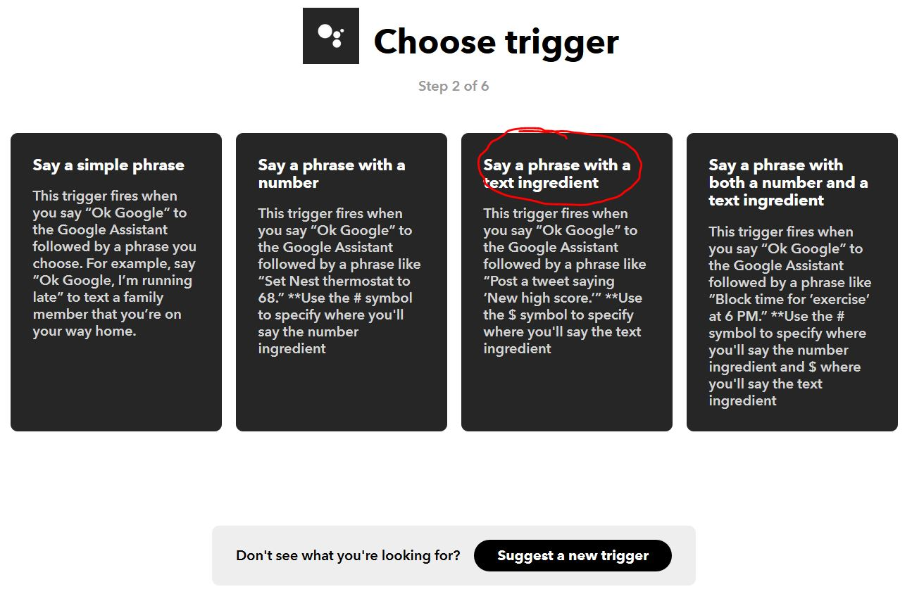

# ifttt_php_nodered
Domotic voice control

This example is to have information for voice control his DIY domotic system.

The aim is to use "OK Google" and tell "domotic light on" and then you can switch IO on the rapsberrypi interface.

The evolution of this tutorial is to use MQTT to send command to an arduino board for controlling Ligthing. 

## TO DO

 * Add arduino file example

 
# PREREQUISITES
 
Before using this example, it's necessary to have these differents elements :

1. A raspberrypi with raspbian OS and these software (node red, apache with php support, MQTT mosquitto broker)
```
 * sudo apt-get install mosquitto
 * sudo apt-get install apache2
 * sudo apt-get install php
 * sudo apt-get install nodered
```

2. Some external diy domotic system (for example light neopixel control by MQTT using ESP32 or ESP8266 module)
 - I will put and arduino example (neopixel control)

3. A free account open on IFTTT (https://ifttt.com/)

4. A valid google account for generate the voice command with "OK google..."

# IFTTT configuration

After connected to your IFTTT account, create a new applet 


Search the service "Google asssitant"


Choose the "Say phrase with the text ingredient"



Set the passphrase key before the $ character. After tell OK Google, tell the passphrasekey, google assistant transmit the text after to parameter 

Fill the filed "What do you want the -assistant to say in response" to have the call back of your voice command.


After click of the second + after the "then"
 


Choose the action Webhook (Make a web request)
 


Complete the action with the php link of the webserver on the rapsberrypi and add the "TextField" for transmit the google text to the php file.


Select Content type with "text/plain".


Select FINISH to validate the applet (Google assistant -> webhook).


Now the applet is ready to transmit google voice text to the php file.

If you use your phone with google voice and you tell "Ok google domotic light on". Then your phone return "light on".


# NODE RED script

After running nodered on the raspberrypi, open the link for adding the script to capture the google voice text.

The NodeRed interface is at this link : http://raspberrypi_adress:1880


Open the script test with notepad and add the script by copy paste the text to import/clipboard.


# PHP file

Add the php file "ifttt_websocket_nodered_gateway.php" on the raspberrypi webserver.

The file will be copied in the /var/www/html/ifttt_websocket_nodered_gateway.php


